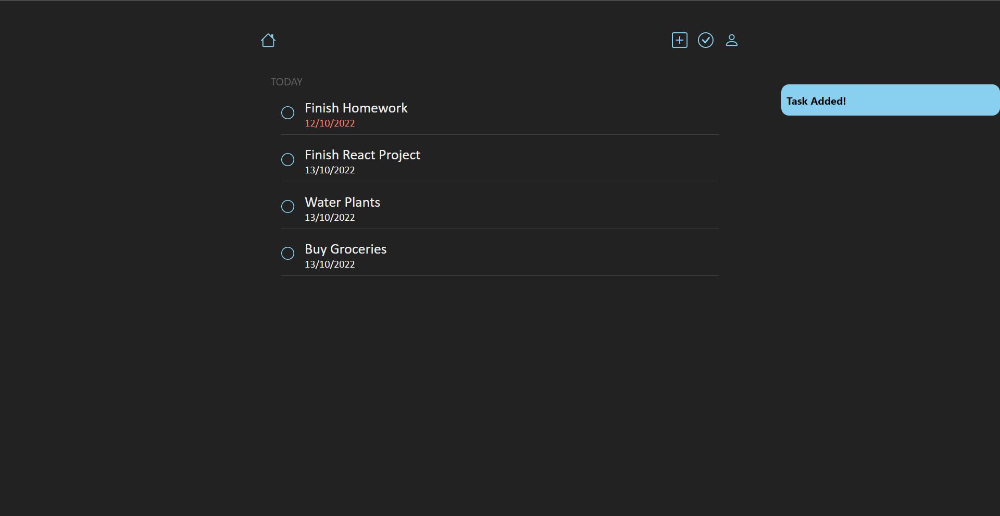
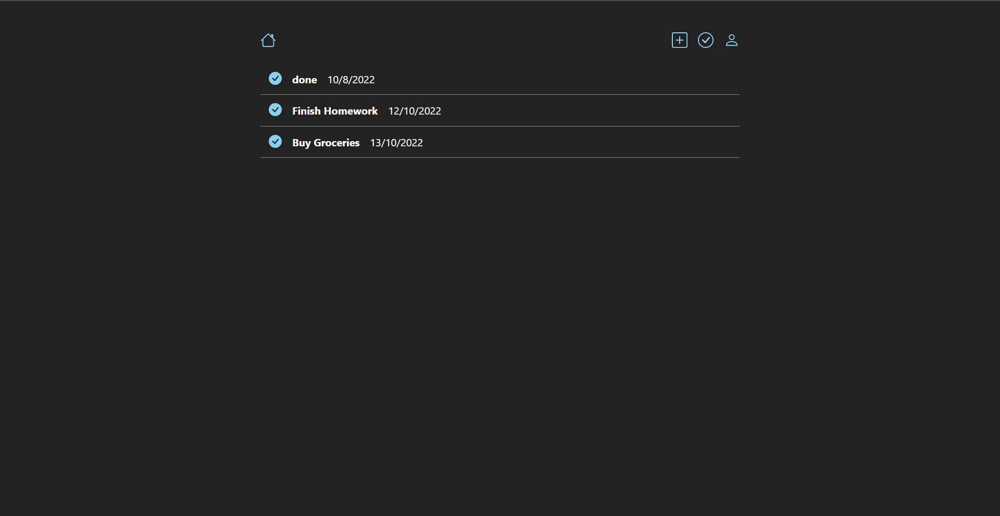
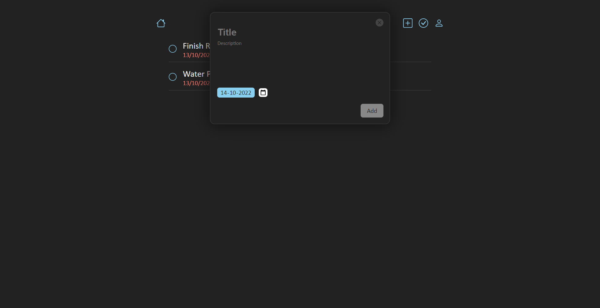

# Tasks App: MERN Stack CRUD Application
## A basic MERN application for keeping a to-do list
A basic MERN application for keeping a to-do list. Users can create new tasks, mark tasks as completed and view previously completed tasks. JSON Web Tokens are used for authorization. Frontend is built with React, keeping a dark themed layout.

I developed the backend with ExpressJS, using MongoDB for persistence of data. For authorization, I used JSON Web Tokens. I designed the user interface myself, where I chose an overall dark theme for the app, and then I developed it with ReactJS. I also used React-redux and React-router libraries.

## Features

## Gallery

  
  
   

